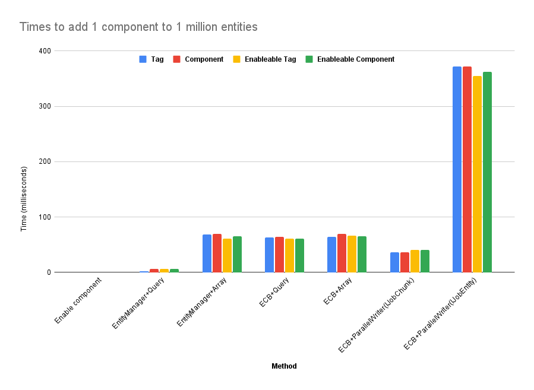

# Some code Snippets

## System Groups
- Use this pattern to sync with GameObjects
- Apply this to create additional groups inside other groups like FixedStepSimulationGroup

```csharp
using Unity.Entities;

// A group that runs right at the very beginning of SimulationSystemGroup
[UpdateInGroup(typeof(SimulationSystemGroup), OrderFirst = true)]
[UpdateBefore(typeof(BeginSimulationEntityCommandBufferSystem))]
public partial class PreSimulationSystemGroup : ComponentSystemGroup { }

// A group that runs right at the very end of SimulationSystemGroup
[UpdateInGroup(typeof(SimulationSystemGroup), OrderLast = true)]
[UpdateAfter(typeof(EndSimulationEntityCommandBufferSystem))]
public partial class PostSimulationSystemGroup : ComponentSystemGroup { }

[UpdateInGroup(typeof(PreSimulationSystemGroup))]
public partial class CopyManagedDataToECSSystem : SystemBase
{
    // Copy data from managed objects (such as MonoBehaviours) into components
    protected override void OnUpdate() { }
}

[UpdateInGroup(typeof(SimulationSystemGroup))]
public partial struct ProcessDataSystem : ISystem
{
    // Process the ECS simulation.
    public void OnUpdate(ref SystemState state) { }
}

[UpdateInGroup(typeof(PostSimulationSystemGroup))]
public partial struct CopyECSToManagedDataSystem : ISystem
{
    // Copy processed data from components back into managed objects
    public void OnUpdate(ref SystemState state) { }
}
```

## Define Archetype before creating the entities

To avoid adding components loosely and reduce the number of structural changes

```csharp
// create archetype and entity in a Burst-friendly way
var abComponents =  new FixedList128Bytes<ComponentType> {
   ComponentType.ReadWrite<A>(),
   ComponentType.ReadWrite<B>(),
}.ToNativeArray(state.WorldUpdateAllocator);

var abArchetype = state.EntityManager.CreateArchetype(abComponents);
var entity = state.EntityManager.CreateEntity(abArchetype);

// ... Some time later... 
state.EntityManager.AddComponent<C>(entity);
```

A Common mistake is constructing entities at runtime by adding one component at a time
```csharp
// Cache this archetype if we intend to use it again later
var newEntityArchetype = state.EntityManager.CreateArchetype(typeof(Foo), typeof(Bar), typeof(Baz));  
var entity = EntityManager.CreateEntity(newEntityArchetype);


// Better yet, if you want to create lots of identical entities at the same time  
var entities = new NativeArray<Entity>(10000, Allocator.Temp);
state.EntityManager.CreateEntity(newEntityArchetype, entities);
```

About the time it takes for adding components to an entity (structural change).
see [this](https://connect-prd-cdn.unity.com/20230302/30b9527c-ac9f-4795-9359-4f3eef610839/Structural%20Change%20Benchmarks.pdf)


https://blog.innogames.com/unitys-performance-by-default-under-the-hood/


## Adding or removing multiple components simultaneously
If you need to add or remove more than one component to an entity (or a set of entities) at runtime, 
you can use the ComponentTypeSet struct to specify all of the components to be added or removed at once, 
which helps to minimize the number of structural changes and redundant archetypes. 
The struct can be passed to EntityManager methods such as:

- `AddComponent(Entity, ComponentTypeSet)`
- `AddComponent(EntityQuery, ComponentTypeSet)`
- `AddComponent(SystemHandle, ComponentTypeSet)`
As well as the equivalent `RemoveComponent()` methods.


## Build NativeArray<Entity> in a chunk-friendly way
If you need to build a NativeArray of entities to apply a structural change to, try to ensure that the entity order in the array matches the order of the entities in memory. 
The simplest way to do this is with an IJobChunk which can iterate over the chunks matching your target query. 
The job can iterate over the entities in the chunk in order and build a NativeArray of the entities that the change should be applied to. 
This NativeArray can be passed to an `EntityCommandBuffer.ParallelWriter` to queue up the required changes. 
When the EntityCommandBuffer is executed, entities will be accessed one by one via lookups to the EntityManager which will inevitably involve indirection, 
but because the entities will be accessed in order, the process will increase the chances of CPU cache hits.

https://learn.unity.com/tutorial/part-3-2-managing-the-data-transformation-pipeline


